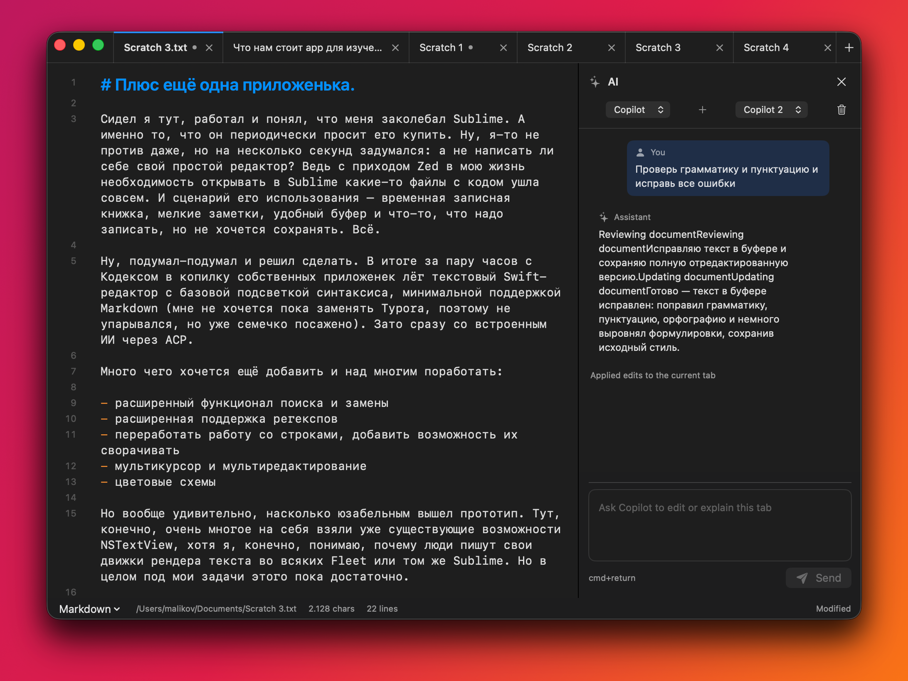

# SimpleLime

Scratch-first text editor for macOS. It keeps temporary notes alive across app restarts, opens normal text files, has line numbers, Markdown preview, syntax highlighting, search/replace, text transforms, and basic AI assistance through Agent Client Protocol.



## Why?

Sublime is still great as a place to dump temporary text, but I wanted a smaller native macOS editor focused on scratch buffers: quick notes, copied snippets, drafts, Markdown, and files that should survive a reboot even before they are saved.

SimpleLime is not trying to replace a full IDE. It is a fast working notebook with editor habits I use every day.

## Features

- Restored scratch buffers that survive app restarts
- Open and save regular text files
- Chrome-style tabs in the window title area
- Always-on line numbers and current-line highlight
- Soft wrap by default
- Basic syntax highlighting for Markdown, Swift, JavaScript, TypeScript, JSON, HTML, CSS, Python, Ruby, Go, Rust, and shell
- Markdown preview
- Find, replace, regex search, find in all tabs, select all matches
- Multi-cursor basics
- Text transforms: uppercase, lowercase, title case, duplicate line or selection, sort lines, unique lines, trim trailing whitespace, join lines
- Font size controls
- AI chat per tab with multiple sessions
- ACP integration for Copilot and configurable Codex-compatible agents

## Shortcuts

| Shortcut | Action |
| --- | --- |
| `⌘N` | New scratch buffer |
| `⌘O` | Open file |
| `⌘S` | Save |
| `⌘W` | Close tab |
| `⌘F` | Find |
| `⌘R` | Find and replace |
| `⌘⇧F` | Find in all tabs |
| `⌘⇧L` | Select all matches |
| `⌘D` | Duplicate line or selection |
| `⌃Tab` | Next tab |
| `⌃⇧Tab` | Previous tab |
| `⌘+` / `⌘-` | Increase / decrease font size |
| `⌘⇧P` | Toggle Markdown preview |
| `⌘⇧I` | Toggle AI panel |

## AI

SimpleLime talks to local agents through [Agent Client Protocol](https://agentclientprotocol.com/). Copilot works with the current GitHub Copilot CLI ACP server:

```bash
copilot --acp --stdio
```

Codex is configurable in Settings. The default command is `codex-acp`, so it will work when a Codex ACP adapter is available on `PATH`.

## Install

### Homebrew

```bash
brew install --cask alexrett/tap/simplelime
```

### Download

Grab the latest `SimpleLime.dmg` from [Releases](https://github.com/alexrett/simplelime/releases).

### Build from Source

```bash
git clone https://github.com/alexrett/simplelime.git
cd simplelime
swift build -c release --arch arm64 --arch x86_64
```

To create a signed release build locally:

```bash
./build.sh release
```

Set `IDENTITY` and `NOTARY_PROFILE` in `.env.local` if you need to override the defaults.

## Requirements

- macOS 13.0 (Ventura) or later
- Works on Apple Silicon and Intel Macs

## License

MIT
