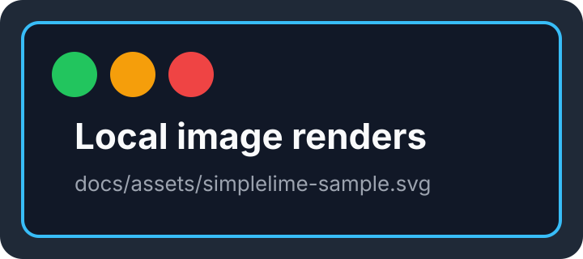
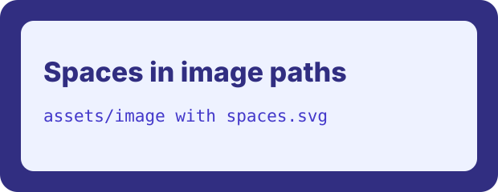
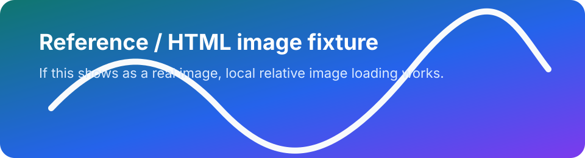
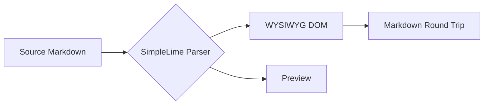
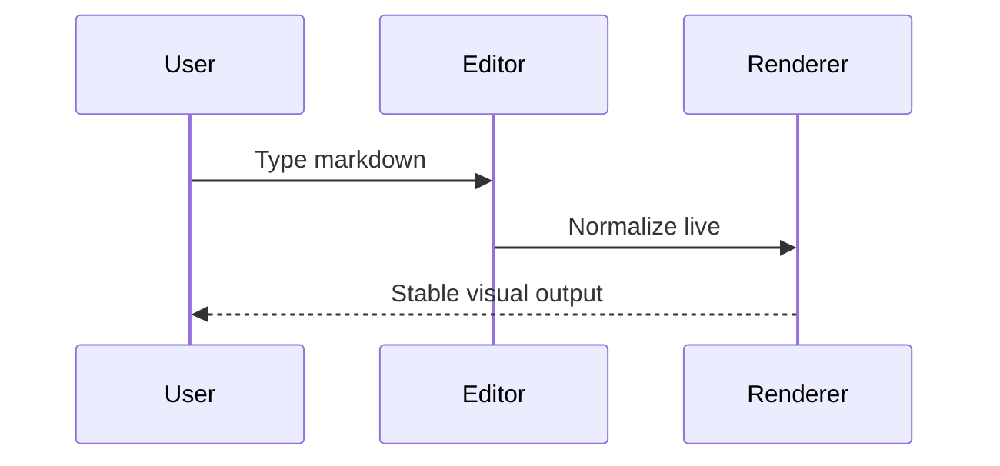

# SimpleLime Markdown Visual Fixture

[toc]

This document is a visual QA fixture for SimpleLime Markdown editing. Open the `docs` folder through the document catalog, then open this file and switch between source, preview, and WYSIWYG modes.

## Inline Markdown

Plain text with **bold**, __strong__, *italic*, _emphasis_, `inline code`, ~~deleted text~~, ==highlighted text==, H~2~O, x^2^, inline math $E = mc^2$, a footnote reference[^inline], <u>safe underline HTML</u>, and <kbd>Cmd</kbd> + <kbd>K</kbd>.

Inline links should work: [SimpleLime repository](https://github.com/alexrett/simplelime), [reference docs][docs-ref], and an autolink <https://example.com/markdown>.

## Lists

- Unordered item with **bold** text
- Unordered item with `code`
  - Nested unordered child
  - Nested child with ==highlight==
- [ ] Unchecked task
- [x] Checked task

1. Ordered item one
   1. Nested ordered child
   2. Nested ordered sibling
2. Ordered item two with [reference docs][docs-ref]
3. Ordered item three with inline math $a^2 + b^2 = c^2$

## Quote And Callout

> A normal blockquote with *inline formatting* and a link to <https://example.com>.

> [!NOTE]
> Callout body with **bold**, `code`, and a footnote reference[^callout].

## Table

| Feature | Expected rendering | Status |
| :--- | :---: | ---: |
| Markdown image | Local image appears, not alt text | ready |
| Mermaid graph | Diagram appears without a mode toggle | ready |
| Table editing | Cells remain editable in WYSIWYG | ready |
| Math | KaTeX if online, fallback if offline | ready |

## Images






Inline reference image: ![Reference image][sample-image]



## Mermaid





## Math

Inline math should stay in flow: $f(x) = \frac{x_1}{\sqrt{x^2 + 1}}$.

$$
\frac{a^2 + b^2}{c^2} = 1
$$

## Code

```swift
struct Note {
    var title: String
    var body: String
}
```

```markdown

```

## HTML Media

<video src="https://example.com/movie.mp4" controls></video>

<iframe src="https://example.com" title="Example iframe" width="560" height="180"></iframe>

## Rules And References

---

Reference definitions should be preserved and usable by WYSIWYG paragraphs.

[docs-ref]: https://example.com/docs "Reference docs"
[sample-image]: assets/simplelime-wide.svg "Reference image title"

[^inline]: Footnote definition with **bold** text and a reference link to [docs][docs-ref].
[^callout]: Footnote used from the callout section.
